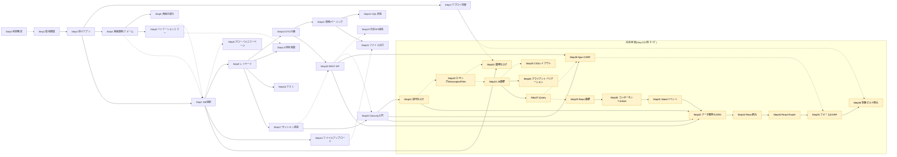

<!-- template-version: 2026-08-22.24 -->

# SpringBoot Web開発 学習カリキュラム(汎用テンプレート)

対象: Javaの基礎(OOP・コレクション・例外処理・ラムダ/Stream)を一通り学んだ人が、
SpringBootでWebアプリケーション開発を段階的に学ぶためのカリキュラム。

**前提バージョン**: Spring Boot 4.x / Java 21 LTS(または25 LTS)を前提に記述する。
バージョンが変われば、アノテーション名・設定キー・デフォルト値等の個々の記述が
現行と食い違う可能性がある。プロジェクトの実際のバージョンがこれと異なる場合、
メンターは`pom.xml`の実際のバージョンを確認した上で、該当箇所の記述が現行バージョンでも
成立するかをその場で検証してから使う(うろ覚えで書き写させない、という既存方針と同じ)。

このファイルはプロジェクト非依存のテンプレートです。学習を始めるプロジェクトに
`.claude/state/learning-springboot/CURRICULUM.md` が無い場合、このファイルをコピーして使います。
その際、冒頭の`<!-- template-version: ... -->`コメントもそのままコピーする
(更新確認のための版数マーカー。詳細は`SKILL.md`の初期化ロジック参照)。

各Stepは **目的 / 概念 / 前提Step / 完了条件(Definition of Done)** を持ちます。
前提Stepは「この順で進めることを推奨する」という情報であり、強制ではありません。
別のStepから始めたい場合はそちらを優先してよいですが、前提が未完了だと
難易度が上がる場合がある旨をメンターは伝えます。

**前提Stepには2種類ある**: (1) 前のStepで作ったコード・データ構造がそのまま次のStepの
実装土台になる**技術的な前提**(例: Step9のレイヤー構成が無いとStep10のDTO分離は
成立しない)と、(2) 前提が無くても実装自体は成立するが、理解のしやすさ・動機付けの
ために先にやることを勧めるだけの**推奨順のみ**(例: Step7のDB接続がまだでも
Step8のエラーページ自体は作れる)。**前提Step欄に特に注記が無ければ技術的な前提を
意味し、「(推奨順のみ)」と注記があるものは技術的な依存が無い**。この区別は、
学習者が前提Stepを飛ばして進んだときにメンターが出す警告の強さ(「動かない可能性が
高い」か「多少分かりにくいが進められる」か)を左右する。

**Step番号とid**: 見出し行末の`<!-- id: xxx -->`が**変更されない一意の識別子**で、
「Step12」のような表示用の番号は自由に変更してよい。学習者の
`.claude/state/learning-springboot/PROGRESS.md`はidで完了状態を管理するため、番号を
変更しても完了記録は失われない(詳細は[`references/maintainer-notes.md`](maintainer-notes.md)参照)。
Step0チェックリストの各項目にも同様に`id`列がある。
**idを付ける対象は「学習内容を持つセクション」全般**で、Stepの見出しに限らない
(「アプリの題材決め」「発展メニュー」「React編」等)。`## 目次`や`## 修了基準`の
ような索引・要約だけの見出しには付けない。

参考URL(公式ドキュメントや解説記事)は、このファイルには固定で書きません。
技術情報は古くなるため、学習者が今どのStepの何につまずいているかに応じて、
メンターがその場でWeb検索して提示する方針です(`SKILL.md`参照)。

## 目次

Step0(前提確認)/ Step1(環境構築)/ アプリの題材決め/ Step2(最小アプリ)/ Step3(デプロイ体験)/
Step4(画面遷移・フォーム)/ Step5(画面共通化)/ Step6(バリデーションエラー)/
Step7(DB接続)/ Step8(グローバルエラーページ)/ Step9(レイヤード)/
Step10(DTO分離)/ Step11(検索・ページング・ソート)/ Step12(SQL実践)/
Step13(排他制御)/ Step14(ファイルアップロード)/ Step15(ファイル出力)/
Step16(テスト)/ Step17(セッション認証)/ Step18(REST API)/ Step19(外部API連携)/
Step20(Security入門)/ Step21(認可仕上げ・任意)/ Step22(ロギング・Interceptor・Filter・任意)/
Step23(運用仕上げ・任意)/ Step24(JS基礎・任意)/ Step25(CSSレイアウト・任意)/
Step26(クライアントバリデーション・任意)/ Step27(jQuery・任意)/ Step28(Ajax+CSRF・任意)/
Step29(React基礎・任意)/ Step30(コンポーネント/props・任意)/ Step31(State/イベント・任意)/
Step32(データ取得/CORS・任意)/ Step33(React統合・任意)/ Step34(React Router・任意)/
Step35(フォーム/CSRF・任意)/ Step36(本番ビルド統合・任意)/ 発展メニュー

Step番号は目次上の並び順(=学習順)と一致している。**必須StepはStep0〜Step20まで**
(バックエンドの中核部分+Spring Securityによる認証の安全化)。Step21以降(認可・
ロギング・フロントエンド・React編)はすべて任意/発展Stepであり、修了の必須条件には
含めない(必須期間を短縮しつつ、認証を平文パスワードのまま終わらせないための構成)。

## 修了基準

このカリキュラムにおける「修了」は、**Step0〜Step20が完了していること**
(Step0チェックリストは全項目(このテンプレートのままなら16項目)すべて`未実証`以外の
状態になっている——実証条件が(a)(b)(c)に分かれている項目は、全ての条件について判断が
済んでいることが条件、Step1〜20が全て「完了」)を基本ラインとする。**Step21以降
(Step21〜Step36、発展メニューを含む)は、いずれも任意/発展Stepであり修了の必須条件には
含めない**。これには認可の作り込み・ロギング・フロントエンド(JS/CSS/jQuery/Ajax)・
React編が含まれる——必須期間を短くするため、意図的にここで線を引いている
(ただしSpring Securityによる認証の安全化(Step20)自体は必須に含める)。

修了の判定は、`.claude/state/learning-springboot/PROGRESS.md`の記録を鵜呑みにせず、
実際のリポジトリの状態を横断的に確認した上で行う(`SKILL.md`のモード6「修了確認」参照)。
退行や記録の付け間違いがあり得るため、最終確認は必ずコードを実際に見て行う。

任意のStepから始められるように、前提関係を図にしておく。**実線矢印(`-->`)は技術的な
前提(前のStepの成果物が無いと成立しない)、点線矢印(`-.->`)は推奨順のみ(前提が
無くても実装は成立する)を示す**。どちらも強制ではない。

(黄色の破線枠のノードは「任意/発展」Stepを示す。必須Stepの完了はこれらに依存しない。
矢印の実線/点線とノード自体の破線枠は別の意味なので混同しないこと。)

## Step0: 前提確認(Java基礎の棚卸し) <!-- id: prereq-check -->
- 目的: Web開発に入る前に、Java基礎が実務レベルで使えるか確認する。
- 前提Step: なし
- 完了条件: 下記チェックリストの各項目が`未実証`以外の状態(会話で確認済み・
  コードで実証済み・対象外のいずれか)になっていること。

Step0は他のStepと違い、**単発のCLI課題では終わらせない**。以降のStep(Step1〜)で
実際にこのアプリを作っていく過程で、各項目が本物のコードとして使われているかを
その都度チェックし、実証済みにしていく。単なる知識確認ではなく「実際に使えているか」を見る。

### チェックリスト

| id | # | 項目 | 実証条件(このプロジェクトのどこかで使われていればよい) | 未実証なら促す先 |
|---|---|---|---|---|
| basic-syntax | 1 | 基本構文(if/for/while等) | 分岐・繰り返しを使った処理がどこかにある(Controller/Serviceの条件分岐等) | Step2(最小アプリ) |
| method-design | 2 | メソッド設計(引数・戻り値・オーバーロード) | 引数・戻り値を適切に設計したメソッドがある。オーバーロードの必要性を説明できる | Step2〜Step4 |
| class-design | 3 | クラス設計・コンストラクタ設計 | Entity/DTOが、責務の合った単位で設計され、不要なsetterを持たない | Step10(DTO設計) |
| record-immutable | 4 | record(不変データクラス) | DTOやちょっとした値オブジェクトを`record`で表現している、または「なぜここは`record`にしなかったか」を説明できる | Step10(DTO設計) |
| interface-abstraction | 5 | interfaceによる抽象化 | `JpaRepository`の継承に加え、Serviceそのものをinterface+実装クラスに分けている、または差し替え可能な設計がある | Step9(レイヤードアーキテクチャ) |
| enum-type-safety | 6 | enum(状態・種別の型安全な表現) | ロールや種別のような固定値を、生の文字列比較ではなく`enum`で表現している | 貸出状態のような「種別・ステータス」はStep9(レイヤードアーキテクチャ)時点でも実装され得るため、その段階で機会があれば促す。「ロール」の実例(例: `"ADMIN".equals(user.getRole())`)は、Step20(Spring Security、**必須**)で`UserDetailsService`が返す権限(authorities)を設計する時点が必ず来る実証機会——ここでロールをenumで表現するよう促す。Step21(認可、任意/発展)まで進めばさらに実践的な使い方(`@PreAuthorize`でのロールベース認可)で定着する。Step20は必須のため、必須部分を修了する学習者は全員この機会を通る。役割・種別に相当する概念が題材に無いまま進めている場合に限り「会話で確認済み」でよい |
| exception-handling | 7 | 例外処理の使い分け(try-catch-finally、try-with-resources/AutoCloseable、独自例外) | (a)try-catch-finallyの基本構文を説明・使用できる。(b)独自例外クラス(例: `〇〇NotFoundException`)を定義し、適切な層でスローしている。(c)ファイルI/O等リソースを扱うコードがあれば、try-with-resourcesで自動クローズしている | Step18(REST API/例外処理)。(b)はStep13(`OptimisticLockingFailureException`の業務エラー変換)も実証機会。(c)はStep15(ファイル出力)が必ず来る実証機会——Step15は必須Stepのため(c)に「対象外」は原則選ばない。Step15着手前は「会話で確認済み」に留めてよい |
| collection-ops | 8 | Collection操作 | `List`/`Map`/`Set`に対する重複除去・ソート・集計等の操作がある | Step2〜Step4(最小アプリ/フォーム)。Step12(SQL実践)でJPQLの集計クエリ結果(件数・合計等)をJavaのCollectionで受け取り加工する場面も実証機会になる |
| generics | 9 | ジェネリクス | `JpaRepository<Xxx, Long>`のような型パラメータ付きの宣言を読み書きできる | 実際にはStep7(DB接続)でRepositoryを書いた時点で満たされることが多い。Step7完了時点のレビューで先に確認し、そこで満たされていなければStep9(レイヤードアーキテクチャ)で改めて確認する |
| stream-api | 10 | Stream API | `.stream().filter().map()`等を使ったコレクション処理・変換がある | Step10(Entity→DTO変換)。Step12(SQL実践)で集計クエリの結果セットを`.stream()`で加工する場面も実証機会になる |
| optional | 11 | Optional | `Repository`の検索結果を`Optional`のまま扱い、`orElseThrow`等で例外に変換している | Step9(Service層) |
| equals-hashcode | 12 | equals/hashCodeの契約 | Entity(特に複合主キー相当のクラス)やDTOで`equals`/`hashCode`を意図して定義・確認している(recordなら自動生成される点との対比も含む)。**JPA Entityについては、`@GeneratedValue`で自動採番されるIDを素朴に`hashCode`へ含めると、永続化前(id未確定)と永続化後でhashCode値が変わり`HashSet`等で不整合を起こす**という落とし穴があることも説明できる(対策の一例: ビジネスキーを使う、`getClass()`ベースの比較にする、`Set`に入れる運用を避ける等) | Step7(DB接続/Entity設計)。題材に複合主キー相当のクラスが無い場合は、単一IDのEntityで`equals`/`hashCode`をどう定義すべきかを口頭で説明できれば「会話で確認済み」でよい |
| lambda-functional-interface | 13 | ラムダ式/関数型インターフェース | `Comparator`やStream内のラムダ、テストの`when(...).thenReturn(...)`のような関数型の記法を使っている | Step10〜Step16 |
| inheritance-polymorphism | 14 | 継承・ポリモーフィズム・抽象クラス | 共通処理を親クラス/抽象クラスに切り出している、または同じinterface/親クラスに対して異なる実装を差し替えて使う設計がある | Step9(レイヤードアーキテクチャ)。この規模のアプリでは継承階層が自然には出てこないことも多いため、無ければ「どこで使うと有効そうか」「なぜここでは使わなかったか」を口頭で説明できるかの確認(「会話で確認済み」ステータス)でよい。今後も出てくる見込みが無いと判断した場合は「対象外」でもよい |
| wrapper-boxing | 15 | ラッパークラス・オートボクシング | `Integer`/`Long`/`Boolean`等のラッパー型を、プリミティブ型ではなく意図して使っている(nullを許容したい場面でラッパー型を選ぶ理由を説明できる) | Step7(DB接続/Entity設計)。Entityの`Long id`、`Boolean isDeleted`等が実例になる |
| access-modifiers | 16 | アクセス修飾子・パッケージ設計 | クラス/メソッド/フィールドの`public`/`private`/パッケージプライベートを意図して使い分けている(全て`public`にしていない) | Step9(レイヤードアーキテクチャ) |

- 各項目の状態は「未実証 / 会話で確認済み / コードで実証済み / 対象外」の4段階。
  `.claude/state/learning-springboot/PROGRESS.md`にStep0専用のサブテーブルとして
  `id`列で対応付けて持つ(「#」は表示用)。
- **実証条件が(a)(b)(c)に分かれている項目でも、状態は項目に1つだけ**。条件ごとに
  判断した上で、**1つでも`未実証`の条件が残っていれば項目全体は`未実証`**とし、
  条件ごとの現状は実証箇所欄に並べて書く。
- 状態の定義・実証済みと判断する条件など運用ロジックの詳細は、`SKILL.md`のモード3および
  「PROGRESS.mdのフォーマット」節を正とする(ここでは重複して記載しない)。

## Step1: 開発環境のセットアップ(選択制: Eclipse / VSCode) <!-- id: ide-setup -->
- 目的: コードを書き始める前に、IDE上で補完・文法エラー表示・デバッグ実行が機能する状態を整える。
- 概念: Mavenプロジェクトのインポート、JDKの紐付け、ブレークポイントを使ったデバッグ実行。
- **IDEは選択制にする**:
  - **選択肢A: Eclipse** — 「Existing Maven Projects」としてインポート。`.project`/`.classpath`/`.settings`が
    自動生成される。「Debug As → Spring Boot App」等でのデバッグ実行に慣れる。
  - **選択肢B: VSCode** — Extension Pack for Java、Spring Boot Extension Packを導入。
    `launch.json`によるデバッグ構成に慣れる。
- 前提Step: Step0(推奨順のみ)
- 完了条件: 以下を**スクリーンショットまたは具体的な挙動の説明で示せる**こと
  (「できました」という口頭申告のみでは完了としない。メンターはIDE画面を直接見られない)。
  1. わざと文法エラーを入れ、IDE上に赤波線/エラー表示が出ることを確認する。
  2. メソッド呼び出しの補完候補が表示されることを確認する。
  3. ブレークポイントで実際に停止させ、その時点の変数の値をインスペクトできることを
     確認する(確認できた変数名と値を報告してもらう)。
- 補足: **アプリの起動・動作確認はIDEのRunボタンではなくターミナルからのMavenラッパー
  (`./mvnw`または`mvnw.cmd`。**PowerShellでは`.\mvnw.cmd`のように`.\`が必要**——詳細は
  Step3参照)で行う**ことをここでルール化しておく(IDEのRunはclasspathや作業ディレクトリの
  扱いが異なり、CI/本番相当の挙動と食い違いやすいため)。デバッグ実行はIDE、それ以外の
  起動確認はターミナル、という役割分担を習慣化する。

## アプリの題材決め(Step2に着手する前に) <!-- id: topic-selection -->

このカリキュラムで作るアプリの題材(何を管理するアプリにするか)は、**学習者が
自由に決めてよい**(業務で扱う題材、趣味の題材など、本人が興味を持てるものが
望ましい)。ただし、メンターは題材を決める段階で一度、その題材がカリキュラム全体を
通して学習に耐えるかを確認し、不足があれば拡張を提案する。

後半のStepの完了条件は暗黙に特定のデータ構造を前提としており、題材が単純すぎると
到達した時点で作り直しになる。決める段階で以下を満たすか確認する。

- 主となるEntityに加え、関連するEntityが1つ以上ある(例: 「本」に対する「著者」
  「貸出記録」等)。Step10のN+1体験、Step9のレイヤー分けに必要。
- 一覧に検索・並び替えの対象になる属性が複数ある(例: タイトル、カテゴリ、登録日)。
  Step11(検索・ページング・ソート)に必要。
- 利用者に2種類以上の役割が想定できる(例: 一般利用者/管理者)。Step17の認証・
  Step20のSpring Security(いずれも必須)で活きる。認可の作り込み(Step21、
  任意/発展)まで進む場合はさらに活きる。

満たさない題材でも却下はしない。「この題材だとStep10で扱うN+1が体験できないので、
◯◯という関連データを足しませんか」のように、具体的に補強を提案する形にする。
学習者が今は詳細を詰めたくない場合、後のStep(Step9・Step10・Step17等)に着手する
段階で改めて拡張を相談してもよい。

決まった題材は`.claude/state/learning-springboot/CURRICULUM.md`の冒頭に
`<!-- app-topic: 蔵書管理アプリ(本・著者・貸出記録) -->`のような**機械判定できる
マーカー行**として書き残しておく(人間向けの説明文を併記してもよいが、マーカー行は
必須)。この見出し・説明文自体はテンプレートに元から含まれているため、マーカーが
無い状態は「まだ題材が決まっていない」ことを意味する(詳細は`SKILL.md`のモード1参照)。

**学習者への伝え方**: この段階ではEntity・N+1・ページングはまだ学習前。上記3条件は
**メンターが判断基準として使うためのもの**であり、そのまま読み上げない。専門用語を
使わず日常の言葉で尋ねる。例:「本に対する著者や貸出記録のように、関連しあうデータが
2種類以上ありますか」「一覧から絞り込んだり並び替えたりしたくなる項目はありますか」
「使う人に立場の違い(一般利用者と管理者など)はありますか」。

**これは尋ねるときだけでなく、題材決めの対話が終わるまで一貫して適用する**。確定を
伝える場面や補強を提案する場面でも、「**Step10のN+1問題**で困りません」のように未習の
概念名やStep番号を理由づけに持ち出さない(学習者には判断も検証もできない)。
例:「関連しあうデータが複数あるので、後半の少し実務寄りの内容までこの題材のまま
進められそうです」。どのStepで何を学ぶかは、着手するとき(モード1)に説明すれば足りる。

## Step2: Webの基本 + 最小のSpringBootアプリ <!-- id: minimal-app -->
- 目的: HTTPリクエスト/レスポンスを理解した上で、一覧表示だけの最小アプリを作る。
  題材は「アプリの題材決め」で決めたものを使う。
- 概念: `@SpringBootApplication`、組み込みTomcat、`@Controller`、`@GetMapping`。
- 前提Step: Step1
- 完了条件: データはコード内にハードコードした`List`でよい。ブラウザから一覧ページが表示される。

## Step3: デプロイして動かす体験 <!-- id: deploy-experience -->
- 目的: 最小構成のうちに、パッケージング/実行の仕組みを理解する。DBや認証が無い分、
  デプロイの仕組みそのものに集中できる。
- 概念: Mavenの`package`によるjar化、jarの直接起動、ポート/起動ログの見方。(任意でDockerfile)
- 前提Step: Step2
- 完了条件: IDEを使わず、コマンドラインだけでjarを起動し、ブラウザから確認できる。
- **手順はOS/IDEの環境によって変わるので、Step1で選んだ環境に応じて読み替える**:
  - **Windows**: `mvnw.cmd package` → `java -jar target\(jar名).jar`。ターミナルはコマンド
    プロンプト、またはEclipse/VSCodeの統合ターミナルのどちらでもよい。**PowerShellから
    実行する場合はカレントディレクトリのコマンドがパスに含まれないため`mvnw.cmd`単体では
    実行できず、`.\mvnw.cmd package`のように`.\`を付ける必要がある**。
  - **Mac/Linux**: `./mvnw package` → `java -jar target/(jar名).jar`。パス区切りが`/`になる点、
    実行権限(`chmod +x mvnw`)が必要な場合がある点に注意。
  - **Eclipseの場合**: 左下のTerminalビュー、または外部ターミナルから上記コマンドを実行する
    (Exportウィザードでのjar化ではなく、Mavenラッパー経由での再現性を優先する)。
  - **VSCodeの場合**: 統合ターミナル(`Ctrl+@`)からそのまま実行できる。
  - 完了条件を満たしたかどうかは環境に依らず共通(コマンドラインだけで起動しブラウザ確認できるか)。

## Step4: Thymeleafによる画面遷移とフォーム <!-- id: thymeleaf-form -->
- 目的: 一覧→詳細の画面遷移と、フォーム送信の受け取りを実装する。
- 概念: `Model`、`th:each`/`th:if`/`th:switch`、リダイレクト vs フォワード、`@ModelAttribute`、
  `th:object`によるフォームオブジェクトバインディング、チェックボックス/ラジオボタン/
  セレクトボックスの値反映(`th:checked`/`th:selected`)。
- 前提Step: Step2
- 完了条件: 一覧→詳細の画面遷移ができ、フォーム送信でデータを追加できる(永続化はまだ不要)。
  フォームにチェックボックスかセレクトボックスを最低1つ含み、選択状態が正しく反映・送信される。

## Step5: 画面共通化の基礎(Thymeleaf Fragment) <!-- id: template-fragments -->
- 目的: Step4以降、画面数が増えていく前に、ヘッダー/フッターなど共通部分を1箇所にまとめておく。
  CSSによる装飾は行わず、構造上の重複を避けることだけを目的とする(最低限のフロントエンドの範囲内)。
- 概念: `th:fragment`、`th:replace`/`th:insert`によるレイアウト共通化。
- 前提Step: Step4
- 完了条件: ヘッダー/フッターが共通フラグメント化されており、以降の画面追加(Step6以降)でコピペが発生しない。
- 補足: これを後回しにすると、Step6以降に増える画面すべてを後で書き直す手戻りが発生するため、
  ここで先に済ませておく。

## Step6: フォームバリデーションエラーの扱い方 <!-- id: validation-errors -->
- 目的: 入力エラーを検知するだけでなく、画面にフィードバックするところまで実装する。
- 概念: `spring-boot-starter-validation`の追加(Boot 2.3以降`starter-web`には含まれず、
  これを入れないと`@Valid`が反応しない)、`@Valid`、`BindingResult`、`th:errors`、
  エラー時の入力値保持。
- 前提Step: Step4
- 完了条件: 不正な入力を送るとエラーメッセージが表示され、他の入力済み項目は保持されたまま再入力できる。

## Step7: DB接続の基礎(選択制: H2 / PostgreSQL) <!-- id: db-connection -->
- 目的: ハードコードした`List`から実DBへの切り替えを体験する。
- 概念: `spring-boot-starter-data-jpa`、`@Entity`/`@Id`、datasource設定、`ddl-auto`。
- 前提Step: Step2。Step4・Step6は(推奨順のみ)——先に済ませておくとフォームと
  連動させやすい
- 完了条件: DBに保存したデータが一覧画面に表示される。H2かPostgreSQLのいずれかを選んで接続できている。
- 補足: 同じEntity/Repositoryコードのまま設定変更だけでH2⇄PostgreSQLを切り替えられることを確認すると、JPAの抽象化の意味が実感できる。

## Step8: グローバルエラーページ(404/500) <!-- id: error-pages -->
- 目的: 予期しない例外が起きたとき、Spring Bootのデフォルト画面(Whitelabel Error Page。
  Boot 2.3以降、`server.error.include-stacktrace`の既定値は`never`でありスタックトレースは
  表示されないが、エラーコードと汎用メッセージだけの素っ気ない画面のままではユーザー
  フレンドリーではない)をそのまま学習者やユーザーに見せず、分かりやすいエラー画面を
  返せるようにする。
- 概念: Spring Bootのデフォルトエラー処理の仕組み、`src/main/resources/templates/error/`
  配下に`404.html`/`500.html`等を置くだけで自動的に使われる規約、独自の`ErrorController`
  による細かい制御(任意)。
- 前提Step: Step7(推奨順のみ——DBが無くても意図的な例外発生で500ページは作れる)
- 完了条件: 存在しないURLにアクセスすると404用のカスタム画面が、意図的にコード内で
  例外を発生させると500用のカスタム画面が表示される(デフォルトのWhitelabel Error Page
  のままではない)。

## Step9: レイヤードアーキテクチャへのリファクタリング <!-- id: layered-architecture -->
- 目的: Controllerに書いた処理をcontroller/service/repository/entityに分割する。
  あわせて、複数のRepository操作をひとまとまりの処理として扱うトランザクション境界を理解する。
- 概念: 関心の分離、コンストラクタインジェクション、`JpaRepository`、`@Transactional`
  (1つのServiceメソッド内で複数のRepository操作をまとめ、途中で例外が起きた場合に
  それまでの変更もロールバックされる仕組み)。**`@Transactional`は「効いているつもりで
  効いていない」事故が多い機能でもあり、次の3点は少なくとも存在を知っておく**:
  (1) 同一クラス内の自己呼び出し(`this.someMethod()`)ではプロキシを経由しないため
  トランザクションが開始されない、(2) `private`メソッドに付けても同じ理由で効かない、
  (3) 既定では検査例外(checked exception)ではロールバックされない
  (`RuntimeException`とその子孫、または`Error`が既定の対象)。
- 前提Step: Step7
- 完了条件:
  - ControllerがRepositoryに直接依存せずServiceを経由している。DBアクセスはRepositoryに閉じている。
  - 複数のRepository操作をまとめて行うServiceメソッドに`@Transactional`を付け、
    意図的に途中で例外を発生させて、それ以前の変更も含めてロールバックされることを確認できる。
  - 上記の`@Transactional`の落とし穴(自己呼び出し・`private`・検査例外)の**3点
    すべて**について、自分の実装がその罠を踏んでいないかを説明できる(実装を変える
    必要はなく、口頭・コメントでの説明でよい。テストのように新たに作るものが
    増えるわけではないため、3点とも確認する)。

## Step10: DTO設計とAPI/画面の分離 <!-- id: dto-design -->
- 目的: Entityの直接返却をやめ、リクエスト/レスポンス用のDTOに分離する。
  あわせて、Entity→DTO変換時に起きがちなN+1問題に気づき、対策できるようになる。
- 概念: リクエストDTO/レスポンスDTO、バリデーションの層分担(構造的検証はDTO、業務的検証はService)、
  N+1問題(**JPAの既定フェッチ種別は`@ManyToOne`/`@OneToOne`がEAGER、`@OneToMany`/
  `@ManyToMany`がLAZY**。ただしEAGERは「JOINになる」とは限らない——`em.find()`のような
  単純取得ではJOINされるが、JPQL(`SELECT`)でルートEntityを取得した場合、Hibernateは
  EAGER関連であっても取得後に1件ずつ追加のSELECTを発行する。つまり一覧をJPQLで取得する
  一般的なケースでは、`@ManyToOne`のEAGERも`@OneToMany`のLAZYも、どちらも同様に
  N+1(件数分の追加クエリ)を引き起こしうる)、`@EntityGraph`やfetch joinによる対策
  (fetch joinで明示的にJOINさせることが、追加SELECTを防ぐ側の解決策であり、N+1の
  原因ではない)。
- 前提Step: Step9
- 完了条件:
  - Controllerの引数・戻り値にEntityが直接現れない。
  - 関連Entityを持つ一覧表示について、実行されるSQLログを確認し、N+1が発生していないか
    (発生していた場合はどう対策したか)を説明できる。

## Step11: 検索・ページング・ソート <!-- id: search-paging-sort -->
- 目的: 「全件取得」の前提から一歩進め、実務で避けて通れない検索・ページング・並び替えに対応する。
- 概念: `Pageable`/`Page<T>`、Spring Data JPAのページング機能、検索条件をRepositoryの
  メソッド名や`Specification`で組み立てる方法。
- 前提Step: Step10
- 完了条件: 一覧画面がページ番号によって表示件数を絞り込め、何らかの検索条件
  (タイトルの部分一致等)で絞り込み表示ができる。APIやDTOも`Page<XxxResponse>`の
  ようにページ情報(総件数・総ページ数等)を含めて返せる。

## Step12: SQLを自分で書く(JPQL・ネイティブクエリ) <!-- id: sql-native-query -->
- 目的: Spring Dataのメソッド名規約やSpecificationでは表現しきれないクエリを、
  自分でSQL/JPQLとして書けるようになる。あわせて、ORMが実際に発行している
  SQLを読み、意図通りかを自分で確認できるようになる。
- 概念: `@Query`によるJPQL、ネイティブクエリ(`nativeQuery = true`)との使い分け、
  JOIN・GROUP BY・集計関数、パラメータのバインド変数指定(`:name`)と
  文字列連結によるSQLインジェクションの危険、`spring.jpa.show-sql`/
  `spring.jpa.properties.hibernate.format_sql`(`hibernate.format_sql`単体では
  効かない点に注意)による発行SQLの確認、インデックスと`EXPLAIN`による実行計画の確認。
- 前提Step: Step11(メソッド名規約・Specificationでの検索を経験していること)
- 完了条件:
  - メソッド名規約では表現できない集計または複数テーブル結合のクエリを、
    `@Query`(JPQL)で1つ以上実装している。
  - ネイティブクエリを1つ書き、JPQLとの使い分け(いつネイティブが必要か)を
    説明できる。
  - クエリのパラメータを文字列連結ではなくバインド変数で渡しており、
    なぜそうすべきか(SQLインジェクション)を説明できる。
  - 一覧検索で実際に発行されるSQLをログで確認し、検索条件のカラムに
    インデックスを張った場合と張らない場合で実行計画がどう変わるかを確認している。

## Step13: 排他制御と同時実行の考慮 <!-- id: concurrency-control -->
- 目的: Webアプリは常に複数ユーザーから同時にアクセスされる。同じデータを
  同時に更新したときに何が起きるかを実際に再現し、データを壊さない実装が
  できるようになる。
- 概念: lost update(更新の喪失)、楽観ロック(`@Version`、
  `OptimisticLockingFailureException`)、悲観ロック
  (`@Lock(LockModeType.PESSIMISTIC_WRITE)`、`SELECT ... FOR UPDATE`)、
  両者の使い分け(競合頻度とロック時間のトレードオフ)、トランザクション
  分離レベルの基本、競合時にユーザーへどう伝えるかの設計。
- 前提Step: Step9(`@Transactional`の理解)、Step6(推奨順のみ——エラー表示の仕組みが
  あると競合エラーを画面に出しやすい)
- 完了条件:
  - 2つのブラウザ(またはタブ)で同じデータの編集画面を開き、両方から
    更新することで、**後勝ちによって先の更新が失われる**ことを実際に再現できる。
  - `@Version`による楽観ロックを導入し、同じ操作で競合が検知され、
    ユーザーに分かる形でエラーが表示される。
  - 楽観ロックと悲観ロックのどちらを選ぶべきかを、自分のアプリの具体的な
    機能を例に挙げて説明できる。

## Step14: ファイルアップロード(MultipartFile) <!-- id: file-upload -->
- 目的: Webアプリでのファイル受け取りの基本(`MultipartFile`)を学ぶ。次のStep15
  (ファイルダウンロード)とペアで「アップロードしたものをダウンロードできる」という
  一連の流れを体験できるよう、あえてこの直前に置く。
- 概念: `MultipartFile`、フォームの`enctype="multipart/form-data"`、ファイルサイズ・
  拡張子・MIMEタイプの簡単なバリデーション、保存先の選択(ローカルファイルシステムに
  保存してパスをDBに記録する/ファイル本体をDBにバイナリ保存する、の2方式とその
  トレードオフ)、ファイル名の衝突回避(UUID採番等)。
- 前提Step: Step7(DB接続。アップロードしたファイルのメタデータ(元のファイル名・
  保存パス・サイズ等)をDBに記録するため)
- 完了条件:
  - `enctype="multipart/form-data"`のフォームから画像やCSV等のファイルをアップロード
    できる。
  - アップロードされたファイルがサーバー側に保存され、そのメタデータがDBに記録
    されている(保存先としてファイルシステム/DBのどちらを選んだか、その理由を
    説明できる)。
  - ファイルサイズやMIMEタイプ等の簡単なバリデーションがあり、不正なアップロードを
    弾ける。

## Step15: ファイル出力の実務パターン(CSV/Excelエクスポート) <!-- id: file-export -->
- 目的: Step14でアップロードしたファイルの一覧を、今度はダウンロードできるようにする。
  アップロード→ダウンロードという一連の流れを通して、業務でよく求められる「ファイルを
  やり取りする」機能を一通り実装する。単純な文字列連結ではなく、実務で踏みがちな落とし穴
  (文字コード、ダウンロード時のヘッダー、大量データ時のメモリ使用量)に気づく。
- 概念: `HttpServletResponse`への直接書き込みによるダウンロードレスポンス、
  `Content-Disposition`ヘッダーでのファイル名指定、CSVの文字コード問題
  (UTF-8 BOM付き/Shift_JISのどちらでExcelが正しく開けるか)、大量データを
  一度に全部メモリに載せずストリーミングで書き出す意識、(任意)Apache POI等を
  使ったExcel(.xlsx)形式での出力。
- 前提Step: Step11(検索・ページング・ソートで一覧表示ができていること)、
  Step14(推奨順のみ——アップロード→ダウンロードの流れとして直前に行うことを推奨)
- 完了条件:
  - 一覧画面(またはAPI)に「CSVダウンロード」の導線があり、現在の検索条件に
    合致したデータがCSVとしてダウンロードできる。
  - ダウンロードしたCSVをExcelで開いても日本語が文字化けしない(文字コードを
    意図して選んでいる)。
  - なぜその文字コード・出力方式を選んだかを説明できる。
  - (任意)Excel形式(.xlsx)での出力も1つ試している。

## Step16: テストの導入 <!-- id: testing -->
- 目的: レイヤーごとの責務に応じた**テストの書き方(パターン)を一通り経験する**。
  学習目的のため、アプリ全体のテストカバレッジを網羅することは目指さない
  (実務でのテスト戦略・カバレッジ基準は別途学ぶべき発展的なテーマとする)。
- 概念: モック/スタブ(`@MockitoBean`——`@MockBean`/`@SpyBean`はSpring Boot 3.4で
  非推奨・4.0で削除されたため使わない)、`@WebMvcTest`、`@DataJpaTest`。
- 前提Step: Step9
- 完了条件:
  - 分岐・条件判定を含む(if/例外送出/Optionalの分岐等がある)Serviceのpublicメソッドを
    **最低1つ選び**、そのメソッドが持つ分岐パターン数と同数以上のテストケースを書く
    (例: 正常系1件+NotFoundで例外を投げる異常系1件の分岐があるメソッドには最低2件の
    テスト)。全Serviceメソッドを網羅する必要はない。
  - `@WebMvcTest`を使ったControllerのテストを**最低1つ**書き、正常系1件以上・異常系
    (不正パラメータや存在しないID等)1件以上を含む。全Controllerを網羅する必要はない。
  - `@DataJpaTest`(またはRepositoryを対象にしたテスト)を最低1つ試している(任意だが推奨)。
  - どのテストパターンを選んだか、なぜそれを選んだか(このメソッド/Controllerを選んだ
    理由)を説明できる。

## Step17: セッションによる認証の基礎(手作り) <!-- id: session-auth -->
- 目的: `HttpSession`を使って自前のログイン機能を実装し、認証の基本概念を体で理解する。
- 概念: セッションスコープ、Cookie、平文パスワード保存の危険性。
- 前提Step: Step9(レイヤーが確立していること)
- 完了条件: ログイン/ログアウトができ、未ログイン時は保護されたページにアクセスできない。
  **この段階ではパスワードは平文保存のままでよい(意図的にハッシュ化しない)**——
  Step20(Spring Security、**必須**)でこの弱点を解決する、という動機付けのストーリーを
  成立させるため。学習者が自発的にハッシュ化を実装した場合は、その意欲を否定せず、
  Step20では「今度はSpring Securityの標準的な仕組み(BCrypt等)に置き換える」という
  形で引き継ぐ。この平文保存は一時的な状態であり、**Step20が必須である以上、修了時点
  では必ずSpring Securityによるハッシュ化に置き換わっている**。

## Step18: REST APIと例外処理の設計 <!-- id: rest-api -->
- 目的: `@RestController`でJSON APIを作り、業務エラーを適切なHTTPステータスにマッピングする。
- 概念: `@RestController`、`@ExceptionHandler`/`@ControllerAdvice`。
- 前提Step: Step10、Step17(推奨順のみ——セッション認証と対比させると「2種類の入口」
  という動機付けが伝わりやすい)
- 完了条件: JSON APIがDTOを返し、異常系(存在しないID指定など)で適切なHTTPステータスが返る。
- 補足: セッション認証済みのHTML画面と、別途認証が必要なJSON APIという「2種類の入口」が
  併存する状態を作ることが、次のSecurity導入の動機付けになる。

## Step19: 外部API連携(他システムのAPI呼び出し) <!-- id: external-api -->
- 目的: これまでは「自分がAPIを提供する側」だけを学んできたが、実務では「他システムの
  APIを呼び出す側」になることも同じくらい多い。外部API呼び出しと、それに伴う障害への
  向き合い方を学ぶ。
- 概念: `RestClient`(Spring Framework 6.1〜。同期呼び出しの現行の標準的な選択肢)、
  `WebClient`(non-blocking。リアクティブな呼び出しが必要な場面向け)、外部API
  レスポンスのDTOへのマッピング、タイムアウト設定、外部障害時のハンドリング
  (接続エラー・4xx/5xx応答時にアプリ全体を落とさない設計)、外部APIをモック化した
  テスト(WireMock等、または`@MockitoBean`でのクライアント差し替え——`@MockBean`/
  `@SpyBean`はSpring Boot 3.4で非推奨・4.0で削除されたため使わない)。
  **`RestTemplate`は現在Spring公式がメンテナンスモード(積極的な新機能追加なし)と
  位置づけている旧世代のAPI**であり、新規学習では`RestClient`を優先する。ただし
  既存プロジェクトでは今も`RestTemplate`が広く使われているため、読んで理解できる
  程度の認識(名前と立ち位置)は持っておくとよい、という位置づけで触れる程度に留める。
- 前提Step: Step18(推奨順のみ——自分がAPIを提供する経験があると、呼び出す側の視点との
  対比が理解しやすい)
- 完了条件:
  - 何らかの公開API(郵便番号検索API、天気API等の無料API)を`RestClient`
    (または`WebClient`)で呼び出し、レスポンスをDTOにマッピングして画面または
    APIレスポンスに反映できる。
  - 外部APIがタイムアウト・404・500等で失敗した場合でも、アプリ全体が落ちずに
    適切なエラーハンドリング(ユーザー向けのエラー表示や、業務エラーへの変換)ができている。
  - 外部API呼び出しを含む処理のテストが、実際の外部APIに依存せず書けている
    (モックによる差し替え)。

## Step20: Spring Security入門 <!-- id: spring-security-intro -->
- 目的: Step17で体感した手作り認証の弱点(平文パスワード等)をSpring Securityで解決する。
- 概念: `SecurityFilterChain`、`UserDetailsService`、BCrypt、CSRF。
- 前提Step: Step17、Step18(推奨順のみ——REST APIとSecurityの両方の入口があると
  CSRF等の理解が深まる)
- 完了条件: パスワードがハッシュ化されて保存され、Spring Securityのフィルタ経由でログインが機能する。

## Step21: 認可の作り込みとSecurity統合の仕上げ(任意/発展) <!-- id: authorization -->
- 目的: 画面用/API用など用途別に`SecurityFilterChain`を分割し、ログイン後のユーザー特定を
  `SecurityContextHolder`経由に統一する。
- 概念: `@PreAuthorize`(有効化には`@EnableMethodSecurity`が必要——付け忘れると
  `@PreAuthorize`は例外もエラーも出さず黙って無視されるため、「認可できているつもり」の
  誤学習に直結する)、ロールベース認可、`@WithMockUser`によるSecurityのテスト。
- 前提Step: Step20
- 完了条件: ログイン後のユーザー特定が`SecurityContext`経由になっている。ロールごとの
  アクセス制御にテストがある。**他人のIDをURL/パラメータに指定した場合に他人のデータへ
  アクセスできないこと(IDOR: Insecure Direct Object Reference)をテストまたは手動確認で
  検証している**(ロールが同じでも、所有者が異なるリソースへのアクセスは拒否されるか、
  という観点)。

## Step22: ロギング・Interceptor・Filter(任意/発展) <!-- id: logging-interceptor-filter -->
- 目的: Step20〜21で構築したSpring Securityの仕組み(`SecurityFilterChain`)が、
  実はServletコンテナ標準のFilterチェーンの上に成り立っていることを理解する。
  Filterより一段Spring MVC寄りの`HandlerInterceptor`との使い分け、実務で欠かせない
  ロギング設計を身につける。
- 概念: Servlet Filter(`jakarta.servlet.Filter`)。**実際にServletコンテナへ登録される
  Spring Security関連のFilterは`DelegatingFilterProxy`1本のみで、その内部の
  `FilterChainProxy`が、リクエストURLにマッチする最初の1つの`SecurityFilterChain`だけを
  選んで実行する**(複数の`SecurityFilterChain`を`@Order`で並べても、並列に全部通る
  わけではなく「最初にマッチした1本だけが使われる」という点が、認可設定が意図通りに
  効かない典型的な落とし穴になる)、`HandlerInterceptor`(リクエスト処理の前後、どの
  ハンドラメソッドが呼ばれるかにアクセスできる点がFilterとの違い)、SLF4Jによるログ
  レベルの使い分け(DEBUG/INFO/WARN/ERROR)。
- 前提Step: Step21
- 完了条件:
  - 独自の`HandlerInterceptor`(または`Filter`)を1つ実装し、リクエストの処理時間や
    呼び出されたURLをログに出力できる。
  - FilterとInterceptorの違い(扱えるレイヤー、ハンドラ情報へのアクセス可否)を
    自分の言葉で説明できる。
  - ログレベルを使い分けて出力し、本番相当ではINFO以上のみ出すような設定ができる。

## Step23: 運用を意識した仕上げ(任意/発展) <!-- id: ops-readiness -->
- 目的: 開発時の手軽さ(H2、`ddl-auto=update`)から一歩進めて、より実務に近い運用面を扱う。
- 概念: `application-{profile}.properties`によるプロファイル分け、PostgreSQLへの切り替え
  (Step7でPostgreSQLを既に選んでいる場合はこの部分は不要——代わりに本番相当の接続設定を
  プロファイルごとに分ける点に絞ってよい)、Spring Boot Actuator、DBスキーマの
  マイグレーション管理(Flyway/Liquibase)。
  (ログレベルの使い分け自体はStep22で扱い済み。ここではプロファイルごとにログ設定を
  切り替える、という応用に絞る)
- 前提Step: Step7。Step3・Step22は(推奨順のみ)——それぞれデプロイ経験・ログ設計の
  経験があると理解しやすい
- 完了条件:
  - 環境ごとに設定(DB接続先・ログレベルを含む)を切り替えて起動できる。
  - `ddl-auto=update`に頼らないスキーマ管理の仕組み(Flyway等)を最低1つのテーブルに
    対して試せている、またはその必要性(意図しないスキーマ変更のリスク等)を説明できる。

## フロントエンド編(Step24〜28、任意/発展、バックエンド完了後) <!-- id: frontend-section-intro -->

**このフロントエンド編(Step24〜28)は全体が任意/発展Stepであり、修了の必須条件には
含めない**(必須はStep0〜Step20まで)。Step0〜20(バックエンドの必須Step)の間は、
Step5の画面共通化を除いて最低限のThymeleaf(CSS装飾無し、素のHTML相当)で進める。
興味があれば、必須部分の修了後にフロントエンド編へ進んでよい。理由は、Ajax通信や
CSRFトークン連携がバックエンドのREST API(Step18)・Security(Step20)の理解を
前提とするため——Step20は必須Stepなので、フロントエンド編に進む時点で必ず完了している。
Step21〜23(認可〜運用仕上げ)は任意/発展のため、経由していなくてもStep24に
直接進んでよい。

## Step24: JavaScript基礎(DOM操作・イベント・Promise)(任意/発展) <!-- id: js-basics -->
- 目的: jQueryやAjaxに入る前に、素のJavaScriptでDOM操作・イベントハンドリング・非同期処理の基本を理解する。
  あわせて、DOM操作を始めるこの段階でXSS(クロスサイトスクリプティング)の基本的な
  危険性に触れる(SQLインジェクションと同じく、意識せず踏みやすい脆弱性であり、
  DOM操作を扱うこのStepとStep32(React・APIレスポンスの描画)が実際に踏む機会になる)。
- 概念: `document.querySelector`、イベントリスナー、`Promise`、`async`/`await`、
  **XSS対策の意識**(`innerHTML`にユーザー入力由来の文字列をそのまま挿入すると
  スクリプトが実行されうる危険、`textContent`との使い分け、Thymeleafの`th:text`
  (自動エスケープ)と`th:utext`(エスケープ無し、危険)の違い)。
- 前提Step: Step22(推奨順のみ——バックエンドのロギングとフロントエンドのJSに技術的な
  依存関係は無い。Step23は任意/発展Stepであり前提ではない)
- 完了条件: 素のJavaScriptだけで、ボタンクリックに応じて画面の一部を書き換えられる。
  **ユーザー入力(またはDBの登録データ)由来の文字列をDOMに挿入する箇所について、
  `innerHTML`でエスケープ無しに挿入していないか確認し、`textContent`を使うか
  意図的にエスケープしている**。なぜそうすべきか(XSS)を説明できる。

## Step25: CSSレイアウト(任意/発展) <!-- id: css-layout -->
- 目的: 装飾ではなくレイアウト崩れを直せるレベルのCSSを身につける(画面構造の共通化はStep5で対応済み)。
- 概念: Flexbox/Grid、メディアクエリ(レスポンシブ)。
- 前提Step: Step24(推奨順のみ——CSSはJSの内容に技術的に依存しない)
- 完了条件: 主要画面がFlexbox/Gridで崩れずに表示される。

## Step26: クライアントサイドバリデーション(任意/発展) <!-- id: client-validation -->
- 目的: Step6のサーバーサイドバリデーションと対比しながら、即時フィードバック用のクライアント側チェックを実装する。
- 概念: HTML5バリデーション属性(`required`等)、JavaScriptによる入力チェック、サーバー側検証との役割分担。
- 前提Step: Step24
- 完了条件: 明らかな入力ミス(未入力・形式違反)は送信前にクライアント側で気づける。最終チェックはサーバー側(Step6)に残っている。

## Step27: jQuery入門(任意/発展) <!-- id: jquery-basics -->
- 目的: 素のJavaScriptで書いていたDOM操作・イベント処理をjQueryで書き直し、
  何が簡潔になるかを比較する。基礎的なDOM操作を一通りjQueryで行えるようになる
  (深追いはしない)。
- 概念: セレクタ、DOM値の読み書き(`.text()`/`.html()`/`.val()`/`.attr()`)、
  クラス・スタイル操作(`.addClass()`/`.removeClass()`/`.toggleClass()`/`.css()`)、
  `.on()`によるイベントバインド、要素の生成・追加・削除、表示/非表示の切り替え
  (`.show()`/`.hide()`)、要素の走査(`.find()`/`.each()`)。
- 前提Step: Step24
- 完了条件: Step24で書いたDOM操作の一部をjQueryで書き換え、コード量・書き方の
  違いを説明できる。上記の概念それぞれについて、自分のコードの中で最低一度は
  使った経験がある。
- 補足: 動的に追加した要素にもイベントを効かせる「イベント委譲」
  (`.on('click', 'セレクタ', handler)`)は実務でよく使われるが、ここでは
  深追いせず「そういう書き方がある」と知っておく程度で十分。

## Step28: Ajax通信とCSRF連携(任意/発展) <!-- id: ajax-csrf -->
- 目的: 画面遷移を伴わずにサーバーとJSONをやり取りする。Spring SecurityのCSRF保護下でPOSTリクエストを送る。
- 概念: `$.ajax`/`fetch`、JSONのシリアライズ/デシリアライズ、CSRFトークンをヘッダー/パラメータに埋め込む方法、ブラウザ開発者ツール(Networkタブ)でのデバッグ。
- 前提Step: Step18(REST API)、Step20(Security/CSRF)、Step27
- 完了条件: 画面遷移無しでStep18のREST APIにPOSTでき、CSRF保護が有効なままリクエストが成功する。ブラウザの開発者ツールでリクエスト/レスポンスを確認できる。

## React編(Step29〜36、任意/発展。jQuery完了後、または相当の知識がある場合は直接) <!-- id: react-section-intro -->

これまでのStep24〜28はjQuery/素のJavaScriptによるフロントエンド実装だったが、
ここではSpringBootのREST APIをReactから呼び出す構成に発展させる。既存アプリの
画面を段階的にReact化していく形で進める。最初は1画面から始め(Step33)、
慣れてきたら複数画面をReact Routerでつなぐところまで発展させる(Step34)。
どの画面をReact化するか・最終的に何画面まで広げるかは、学習者が作っている
アプリの内容次第であり、特定の画面種別(一覧・詳細等)を前提にしない。

Step23(運用仕上げ)と同様、**このReact編は任意/発展Stepであり、修了の必須条件には
含めない**。jQuery(Step27)までの実装で「Web開発の一通りの基礎」は完了しているため、
Reactへの移行は「実務でSPA構成に触れる機会を前倒しで作りたい」学習者向けの
追加メニューという位置づけ。

**入口は2ルートある**:
- **jQuery経由**: Step24〜28を完了した上でReactに取り組む。jQueryのDOM操作・Ajax・
  CSRFの経験と対比しながら学べるため、初めてフロントエンドに触れる学習者にはこちらを推奨する。
- **直接React**: すでにjQueryやDOM操作・イベント処理の基礎(他プロジェクトでの経験等)が
  ある学習者は、Step24〜28を経由せずStep29から直接始めてよい。この場合、Step28で
  扱うCSRFトークンの知識はStep35で新たに学ぶことになる。

## Step29: React環境構築とJSXの基礎(任意/発展) <!-- id: react-setup -->
- 目的: Node.js/npm環境を整え、既存のSpringBootアプリには手を加えず、JSXの読み書きに
  慣れる。この時点ではstateもAPI通信も扱わない。
- 概念: Node.js/npmのセットアップ、Vite等でのReactプロジェクト作成、JSXの構文
  (式の埋め込み、属性名の違い`className`等)、関数コンポーネントの最小形。
- 前提Step: なし(依存関係マップの`S27 -.-> S29`(点線)は「jQuery経由」の推奨経路であり
  必須ではない)。DOM操作/イベント処理の基礎がある学習者はStep24〜28を経由せず直接始めてよい。
  未経験なら先にStep24〜28を通る方が理解が早い。
- 完了条件: Reactの開発サーバーが起動し、静的なJSX(state・イベントなし)で簡単な画面
  (例: 自己紹介カード、固定データの一覧表示)を表示できる。

## Step30: コンポーネント分割とprops(任意/発展) <!-- id: react-components-props -->
- 目的: 1つの大きな画面を、責務ごとに複数のコンポーネントに分割する設計を身につける。
- 概念: コンポーネントの分割単位(責務・再利用性の観点)、`props`によるデータの受け渡し、
  `children`、同じコンポーネントを異なるpropsで複数回使う再利用。
- 前提Step: Step29
- 完了条件: 1つの画面が親子関係を持つ複数コンポーネントで構成され、propsでデータが
  渡っている。同じコンポーネントを異なるpropsで複数回使っている箇所が最低1つある。

## Step31: State管理とイベントハンドリング(任意/発展) <!-- id: react-state-events -->
- 目的: ユーザー操作に応じて画面が動的に変わる仕組み(state)を理解する。
- 概念: `useState`、イベントハンドラ(`onClick`/`onChange`)、controlled components
  (フォーム入力をReactのstateと同期させる)、stateのリフトアップ(子の操作を親のstateに
  反映する基本パターン)。
- 前提Step: Step30
- 完了条件: フォーム入力がcontrolled componentとしてstateと同期している。親コンポーネント
  が子コンポーネントの操作結果をstateのリフトアップで受け取っている例が最低1つある。

## Step32: 副作用とAPIからのデータ取得(任意/発展) <!-- id: react-data-fetching -->
- 目的: 画面表示時にSpringBootのREST API(Step18)からデータを取得し、非同期処理の結果を
  画面に反映する。あわせて、複数件のデータをリスト表示する際の作法と、開発時特有の
  オリジン越え問題に対処する。
- 概念: `useEffect`と依存配列、`fetch`/`axios`、ローディング/エラー状態の表現、
  クリーンアップ関数が必要になる場面があることに触れる(深追いはしない)、
  `.map()`によるリスト描画と`key`propの必要性(なぜindexをそのまま使うと問題が
  起きうるか)、CORS(Viteの開発サーバーとSpringBootが別オリジンになることで起きる
  問題と、SpringBoot側での許可設定)。**XSSとの関係**(JSXは既定で値を自動エスケープ
  するため、Step24で扱った素のDOM操作ほど無防備ではないが、`dangerouslySetInnerHTML`
  を使うと同じ危険が復活する——「なぜdangerous(危険)という名前が付いているか」を
  Step24のXSSの理解と結びつけて説明できるとよい)。**この時点でSpring Securityが有効になっている
  (Step20〜21が完了済みの)アプリでは、`@CrossOrigin`や`WebMvcConfigurer`だけでは
  不十分で、プリフライトリクエストがSecurityのフィルタ段階で401になる。
  `SecurityFilterChain`側で`http.cors(...)`を明示的に有効化する必要がある**。
- 前提Step: Step31, Step18(REST API。ここで初めて実体的にSpringBoot側の完了が前提になる)、
  Step20・Step21(Securityが有効な状態でのCORS設定が前提になるため)
- 完了条件: コンポーネントのマウント時にSpringBootのREST APIを呼び出し、取得した
  データを`.map()`で一覧表示できる(`key`propが適切に設定されている)。ローディング中・
  取得失敗時の表示がある。開発サーバーとSpringBootが別オリジンの状態でCORSエラーに
  直面し、`SecurityFilterChain`での`http.cors(...)`有効化を含む許可設定によって
  解消した経験がある。

## Step33: 既存画面のReact化(統合・任意/発展) <!-- id: react-integration -->
- 目的: Step29〜32で身につけた要素(JSX、コンポーネント分割、state、データ取得)を
  組み合わせ、既存アプリの画面のうち1つを実際にReactで置き換える。あわせて、複数の
  コンポーネントを統合する規模になって初めて実感できる、propsのバケツリレー
  (prop drilling)問題とその解消策に向き合う。この時点ではReact側は1画面のみでよい
  (複数画面への展開はStep34で扱う)。
- 概念: 既存Thymeleaf画面とReact画面の共存(画面単位の切り替えでよい)、既存のCSS
  (Step25)との整合、propsのバケツリレー(複数階層のコンポーネントを経由してstateを
  受け渡す際の記述の煩雑さ)、Context API(または他の軽量な状態管理手段)による解消。
- 前提Step: Step32
- 完了条件: 既存アプリの画面のうち1つ(どの画面にするかは学習者が作っているアプリの
  内容に応じて選んでよい)がReactで実装され、SpringBootのREST APIからデータを
  取得して表示できる。既存のThymeleaf画面と(画面単位の切り替えで)共存している。
- 補足: Context API等の状態管理は「発展メニュー」止まりにしない。完了レビューで後から
  「使わなかった理由」を尋ねるのではなく、**Step33に取り組んでいる最中に、学習者の実際の
  コンポーネント構成を見ながら能動的に提案する**(例:「この画面と子コンポーネントで同じ
  stateを共有するなら、Context APIに切り替えるとpropsの受け渡しがどう変わりそうですか」)。
  バケツリレーが3階層以上になりそうな設計が見えた時点で提案するのが望ましい。
  Step33に取り組むかどうかは学習者の判断だが、**取り組むと決めた以上、実際に組み込む
  ところまでやってもらう**(`SKILL.md`の「技術・パターンの採用は提案主導で実際にやって
  もらう」参照)。

## Step34: 複数画面のSPA化とReact Router(任意/発展) <!-- id: react-router -->
- 目的: Step33ではReact側を1画面に留めたが、ここでは扱う画面を複数に広げ、
  React Router(または同種のルーティングライブラリ)によるクライアントサイド
  ルーティングを体験する。通常のReactアプリ(複数ビューを持つもの)ではほぼ
  必須級の技術であり、Context APIと同様、Step0を除く「提案主導で実際にやって
  もらう」対象として扱う。
- 概念: `<BrowserRouter>`/`<Routes>`/`<Route>`によるルート定義、`<Link>`/
  `useNavigate`によるクライアントサイド遷移、URLパラメータ(例: `/items/:id`)の
  受け渡し、ブラウザの戻る/進むボタンとの整合、Reactが管理する範囲と既存の
  Thymeleaf画面が管理する範囲の切り分け(Thymeleaf側への遷移は通常の`<a>`タグの
  ままでよい)。**SPAのディープリンク問題**(`/items/1`のようなReact Router管理下の
  URLを直接開く・リロードすると、サーバー側にそのパスの実体が無いため404になる。
  開発サーバー(Vite)はこの問題を自動的に吸収してくれるため、この時点ではまだ
  気づきにくいが、Step36(本番ビルド統合)でjar配信に切り替えた際に必ず踏む
  ——詳細な対応はStep36で扱う)。
- 前提Step: Step33
- 完了条件: React側で2つ以上の画面(どの2画面にするかは学習者が作っているアプリの
  内容に応じて選んでよい。例: 一覧⇄詳細、検索結果⇄編集画面等)が、React Routerに
  よるクライアントサイド遷移でつながっている。URLパラメータを使って表示内容を
  切り替えられる箇所が最低1つある。ブラウザの戻る/進むボタンが正しく機能する。
- 補足: Step33と同様、「Router自体を使うかどうか」の判断を学習者に丸投げしない。
  Step33完了時点でメンターから具体的に提案し、実際に組み込むところまでやってもらう。
  Step34自体を学習対象に含めるかどうかは学習者の判断に委ねてよい。

## Step35: フォーム送信とCSRF連携(任意/発展) <!-- id: react-form-csrf -->
- 目的: 表示だけでなく、Reactからのフォーム送信(作成/更新)をSpring SecurityのCSRF
  保護下で実現し、Step28で学んだAjax+CSRFの知識をReact側でも再現する。
- 概念: POST/PUTリクエストの送信、CSRFトークンの取得・送信(Step28と同様の方式をReact側に
  適用)、送信後の再取得と画面表示の更新。
- 前提Step: Step34、Step28(推奨順のみ——Ajax+CSRFの知識があると理解が早い。
  Step28自体を経由していない学習者は、この時点でCSRFトークンの扱いを新たに
  学ぶことになる旨を伝える)
- 完了条件: Reactの画面からフォーム送信ができ、CSRF保護が有効なままリクエストが
  成功する。送信後、画面の表示内容が更新された結果を反映する。

## Step36: 本番ビルドとSpringBootへの統合(任意/発展) <!-- id: react-prod-build -->
- 目的: Reactの本番ビルド成果物をSpringBootの静的リソースとして配信し、jar単体で
  起動できる状態にする。Step3の「コマンドラインだけでjarを起動する」体験と対になる、
  フロントエンドを含めた完成形を体験する。
- 概念: `npm run build`の成果物配置(`src/main/resources/static`配下等)、Viteのbase
  path設定、SpringBootの静的リソース配信の仕組み、開発時(別オリジン+CORS許可)と
  本番時(同一オリジン、CORS設定不要)の違い、**Step34で触れたSPAのディープリンク
  問題への対応**(React Router管理下のパスへの直接アクセス・リロードでも404になら
  ないよう、該当パスへのリクエストを`index.html`にフォールバックさせる設定
  ——例: `WebMvcConfigurer`で静的リソースにもAPIにもマッチしないパスを`index.html`に
  転送する)。
- 前提Step: Step35, Step3(jarでの単独起動体験)
- 完了条件: `./mvnw package`(またはWindows PowerShellでの`.\mvnw.cmd package`。Step3参照)
  で作られたjarを起動すると、React側で実装した画面がSpringBoot
  経由(別途Node.jsサーバーを起動せず)で表示・操作できる。本番相当の起動では、
  Step32で対処したCORS設定が不要になる(同一オリジンになるため)理由を説明できる。
  **React Router管理下のURL(例: `/items/1`)を直接ブラウザに入力する、またはその
  画面でリロードしても404にならず正しく表示される**(Step34で作ったルーティングの
  ディープリンクが本番配信でも機能することを確認する)。

## 発展メニュー(任意、順不同) <!-- id: advanced-menu -->

本編で扱わなかったが、今後拡充していきたい要素。優先順位や着手順は都度相談する。

- 国際化(i18n、`messages.properties`)
- OpenAPI/Swaggerによるドキュメント化
- シークレット管理(認証情報の環境変数化)
- キャッシュ・非同期処理(`@Async`)
- CI/CDパイプライン(GitHub Actions等によるビルド・テストの自動化)
