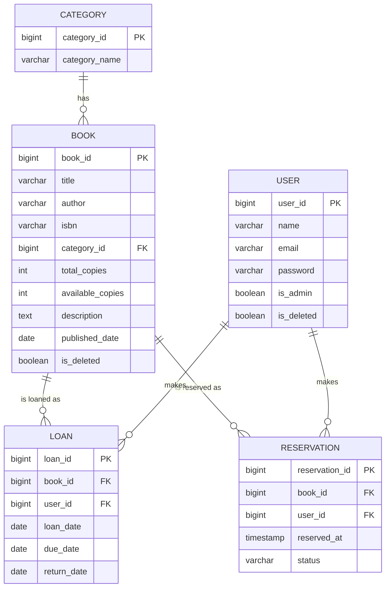
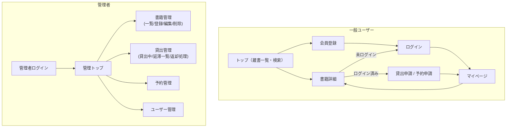

# 蔵書管理・貸出予約システム 開発計画（骨組み）
対象：スケジュール／DB設計／画面遷移／実装フェーズ分割
※開発要綱そのものは別途ご自身で作成される前提のため、ここでは設計・計画の骨組みのみ提示します。

---

## 0. 前提条件

- 開発期間：2026/8/17(月)〜8/23(日) の7日間・1人開発
- 今回の方針：**Spring Securityは後回し**。認証はまずセッション方式の簡易ログインで実装し、時間があれば最終日にSecurity移行を試みる（必須ラインには含めない）
- 既存の学習資産（層分け・DI・JUnit5+Mockito・REST API化・jQuery Ajax・論理削除設計）を最大限転用する

---

## 1. スコープ定義

### MVPライン（必須）
- 簡易ログイン・会員登録（セッション方式、Security未導入）
- 書籍CRUD（管理者）・カテゴリCRUD
- 書籍検索・一覧・詳細（一般ユーザー）
- 貸出処理・返却処理
- 予約機能（在庫切れ時の予約登録・順番管理）
- 管理者：貸出状況一覧・延滞一覧・ユーザー管理
- Service層のJUnitテスト

### 拡張ライン（余力があれば）
- REST API化（DTO/record化・`@RestControllerAdvice`での例外一元化）
- jQuery Ajaxによる検索・貸出/返却の非同期化
- Controller層テスト（`@WebMvcTest`）
- Spring Security本格導入（BCrypt・認可・CSRF）

---

## 2. 実装フェーズ一覧（概要）

| フェーズ | 内容 | 目安日 |
| --- | --- | --- |
| Phase 0 | 設計・準備（DB設計/画面設計/Git初期化/雛形作成） | Day1 |
| Phase 1 | 基盤構築＋管理者向け書籍・カテゴリCRUD | Day2 |
| Phase 2 | 一般ユーザー機能（検索・一覧・詳細）＋簡易ログイン | Day3 |
| Phase 3 | 貸出・返却・予約ロジック（コア業務ロジック） | Day4 |
| Phase 4 | 管理者拡張機能（貸出/延滞管理・ユーザー管理）＋JUnitテスト | Day5 |
| Phase 5 | REST API化・jQuery Ajax化（任意） | Day6 |
| Phase 6 | 仕上げ・バグ修正・（任意）Spring Security最小導入 | Day7 |

**バッファ方針**：進捗が遅れた場合、削る優先順位は Phase5（Ajax化）→ Phase6のSecurity → Controllerテスト網羅、の順。MVPライン（Phase0〜4）は死守。

---

## 3. マスタースケジュール（Day別詳細）

| Day | 日付(曜) | フェーズ | 主なタスク | 成果物 / DoD |
| --- | --- | --- | --- | --- |
| 1 | 8/17(月) | Phase0 | ・要件整理／スコープ確定 ・DB設計（ER図・テーブル定義） ・画面一覧・画面遷移図作成 ・Gitリポジトリ作成、初回コミット ・Spring Initializr雛形作成、DB接続確認 | DB設計書・画面遷移図が完成し、雛形アプリがlocalhostで起動しDBに接続できる |
| 2 | 8/18(火) | Phase1 | ・Entity/Repository実装 ・Category/Book CRUD（管理者向け、Controller/Service/Repository層分け） ・論理削除（is_deleted）方針の実装 | 管理者がカテゴリ・書籍を登録／編集／削除（論理削除）できる |
| 3 | 8/19(水) | Phase2 | ・会員登録、簡易ログイン（HttpSession、Security未導入） ・書籍検索（タイトル/著者/カテゴリ）・一覧・詳細画面 | 一般ユーザーが会員登録→ログイン→検索→詳細閲覧まで一通り動く |
| 4 | 8/20(木) | Phase3 | ・貸出処理（在庫チェック→貸出登録→在庫数減算） ・返却処理（在庫数復元） ・予約登録・予約順番管理（在庫0時のみ予約可） | 貸出/返却/予約の主要業務ロジックがServiceに実装され、在庫数の整合性が取れる |
| 5 | 8/21(金) | Phase4 | ・管理者：貸出状況一覧、延滞者一覧（due_date超過抽出） ・ユーザー管理（一覧・論理削除） ・Service層のJUnitテスト作成 | 主要Serviceにテストがあり全件成功、管理者が貸出/延滞状況を把握できる |
| 6 | 8/22(土) | Phase5（任意） | ・検索・貸出/返却のREST API化（DTO化） ・jQueryによるAjax化 ・Controllerテスト着手 | 時間内で完了した範囲までAPI化・Ajax化が動作する（未完了なら翌日に繰越可） |
| 7 | 8/23(日) | Phase6 | ・全体動作確認・バグ修正 ・README/要綱への実績反映 ・（余力があれば）Spring Security最小導入（BCrypt化程度） | デモ可能な状態に仕上がっている |

---

## 4. フェーズ詳細（目的・完了条件）

**Phase 0：設計・準備**
- 目的：手戻りを防ぐため、実装前にDB構造と画面遷移を固める
- 完了条件：ER図・テーブル定義・画面遷移図が確定し、Gitリポジトリとプロジェクト雛形が用意されている

**Phase 1：基盤構築＋管理者CRUD**
- 目的：層分け（Controller/Service/Repository）の型を最初に作り、以降の実装で使い回す
- 完了条件：カテゴリ・書籍の登録／編集／論理削除がThymeleafで一通り動作する

**Phase 2：一般ユーザー機能＋簡易ログイン**
- 目的：認証はSpring Security抜きで最小実装し、検索・閲覧の導線を通す
- 完了条件：会員登録→ログイン→検索→詳細のフローが通し動作する

**Phase 3：貸出・予約ロジック**
- 目的：本システムの中核である在庫状態管理（貸出中/在庫あり/予約待ち）をServiceに実装する
- 完了条件：在庫0の本を借りようとすると予約に誘導される、返却すると在庫数が正しく戻る

**Phase 4：管理者拡張機能＋テスト**
- 目的：管理側の運用機能を揃えつつ、業務ロジックの単体テストで品質を担保する
- 完了条件：延滞者一覧が正しく抽出される、主要Serviceのテストが全件成功する

**Phase 5：REST API化・Ajax化（任意）**
- 目的：これまでの学習内容（DTO化・例外一元化・jQuery連携）を新規ドメインに再現する
- 完了条件：検索または貸出処理の少なくとも1つがAjaxで非同期化されている

**Phase 6：仕上げ（＋任意でSecurity）**
- 目的：デモ可能な完成度に仕上げる
- 完了条件：主要機能に致命的な不具合がない状態で完了

---

## 5. DB設計

### 5.1 ER図

### 5.2 テーブル定義（草案）

**category**
| カラム | 型 | 制約 |
| --- | --- | --- |
| category_id | BIGINT | PK, AUTO_INCREMENT |
| category_name | VARCHAR(50) | NOT NULL |

**book**
| カラム | 型 | 制約 |
| --- | --- | --- |
| book_id | BIGINT | PK, AUTO_INCREMENT |
| title | VARCHAR(255) | NOT NULL |
| author | VARCHAR(100) | |
| isbn | VARCHAR(20) | |
| category_id | BIGINT | FK → category |
| total_copies | INT | NOT NULL, DEFAULT 1 |
| available_copies | INT | NOT NULL, DEFAULT 1 |
| description | TEXT | |
| published_date | DATE | |
| is_deleted | BOOLEAN | NOT NULL, DEFAULT false |

**user**
| カラム | 型 | 制約 |
| --- | --- | --- |
| user_id | BIGINT | PK, AUTO_INCREMENT |
| name | VARCHAR(50) | NOT NULL |
| email | VARCHAR(100) | NOT NULL, UNIQUE |
| password | VARCHAR(255) | NOT NULL（Phase2は平文、Security導入時にBCrypt化） |
| is_admin | BOOLEAN | NOT NULL, DEFAULT false |
| is_deleted | BOOLEAN | NOT NULL, DEFAULT false |

**loan（貸出）**
| カラム | 型 | 制約 |
| --- | --- | --- |
| loan_id | BIGINT | PK, AUTO_INCREMENT |
| book_id | BIGINT | FK → book |
| user_id | BIGINT | FK → user |
| loan_date | DATE | NOT NULL |
| due_date | DATE | NOT NULL |
| return_date | DATE | NULL可（未返却はNULL） |

**reservation（予約）**
| カラム | 型 | 制約 |
| --- | --- | --- |
| reservation_id | BIGINT | PK, AUTO_INCREMENT |
| book_id | BIGINT | FK → book |
| user_id | BIGINT | FK → user |
| reserved_at | TIMESTAMP | NOT NULL |
| status | VARCHAR(20) | WAITING / AVAILABLE / CANCELLED / COMPLETED |

### 5.3 設計メモ・要検討事項

- **貸出中判定**：`loan`テーブルに状態カラムを持たず、`return_date IS NULL`＝貸出中、`due_date < 今日 AND return_date IS NULL`＝延滞、という動的判定にすると管理が楽（メモにあった`findByGame_GameIdAndUser_UserId`のような命名規則がそのまま応用できます）
- **重複貸出/予約の防止**：`findByBook_BookIdAndUser_UserIdAndReturnDateIsNull`のようなメソッドで「同じ本を同時に2冊貸出していないか」をService側でチェックする設計を推奨
- **予約の順番管理**：`reserved_at`昇順で先着順とし、返却時に一番古い`WAITING`予約を`AVAILABLE`に変える処理をService層に実装（本格的な通知機能までは今回スコープ外でOK）
- **コピー冊数**：複雑化を避けるため「同一タイトルの冊数管理（total_copies / available_copies）」のみとし、個体管理（蔵書番号ごとの管理）はスコープ外とする

---

## 6. 画面設計

### 6.1 画面一覧

**一般ユーザー**
- ログイン画面 `/login`
- 会員登録画面 `/register`
- トップ（蔵書一覧・検索） `/`
- 書籍詳細 `/books/{id}`
- マイページ（貸出履歴・予約状況） `/mypage`

**管理者**
- 書籍管理一覧 `/admin/books`
- 書籍登録・編集 `/admin/books/new`, `/admin/books/{id}/edit`
- 貸出管理（貸出中一覧・延滞一覧・返却処理） `/admin/loans`
- 予約管理 `/admin/reservations`
- ユーザー管理 `/admin/users`

### 6.2 画面遷移図

---

## 7. Spring Security導入タイミングについて

- Phase2の簡易ログインは、これまでのメモにあった「Security導入前」の構成（`HttpSession`＋自前のパスワード照合）を踏襲する想定
- Security移行を行う場合は、Phase6での最小導入（`PasswordEncoder`によるハッシュ化＋`UserDetailsService`）から着手し、`SecurityFilterChain`本格実装・CSRF対策・`@WithMockUser`テストは今回のスコープ外（次回以降の学習課題）とするのが現実的
- 7日間で完走することを優先し、Securityは「完成後の発展課題」という位置づけにしておくと計画が崩れにくいです

---

## 8. 次のアクション

1. 上記のDB設計・画面遷移に対して認識合わせ（修正したい点があれば先に確定）
2. `git init` → リモートリポジトリ作成 → 初回コミット
3. Spring Initializr（Spring Boot 4系）でプロジェクト作成、DB接続確認
4. Phase1（Entity/Repository＋管理者CRUD）に着手
