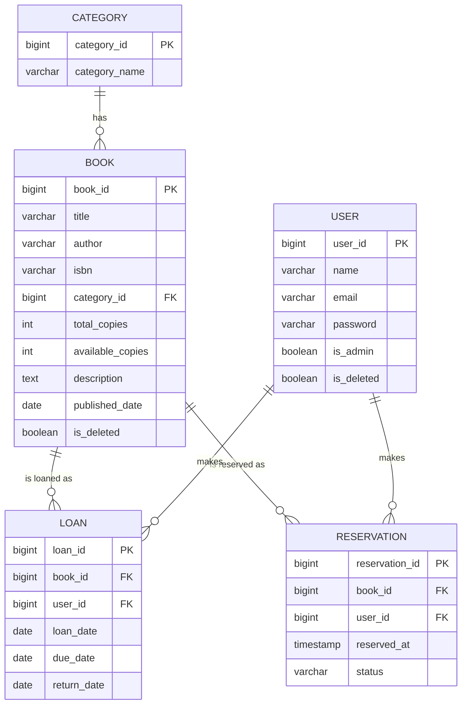
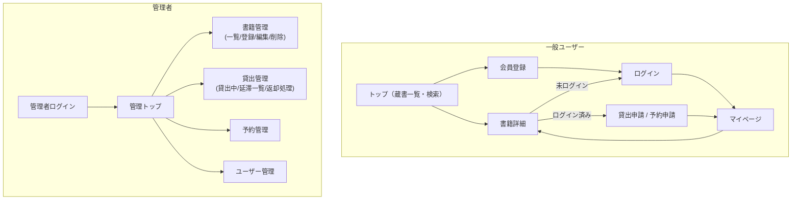

# 蔵書管理・貸出予約システム 開発計画（骨組み）
対象：スケジュール／DB設計／画面遷移／実装フェーズ分割
※開発要綱そのものは別途ご自身で作成される前提のため、ここでは設計・計画の骨組みのみ提示します。

---

## 0. 前提条件

- 開発期間：2026/8/17(月)〜8/23(日) の7日間・1人開発
- 今回の方針：**Spring Securityは後回し**。認証はまずセッション方式の簡易ログインで実装し、時間があれば最終日にSecurity移行を試みる（必須ラインには含めない）
- 既存の学習資産（層分け・DI・JUnit5+Mockito・REST API化・jQuery Ajax・論理削除設計）を最大限転用する

### 【Day2追記】方針転換
今回は完成度の高いプロダクトを作ることより、技術面の定着確認を優先して優先順位を変更する。

- **REST API化・jQuery Ajax化を「任意・最後に回す拡張」から「各機能で最初から使う標準パターン」に格上げする**（Phase5として最終盤に置いていたが、前倒しで各フェーズに組み込む）
- 管理者機能（Phase1で実装済み）は、通常のThymeleaf MVC実装のままにせず、このタイミングでREST API + Ajax方式に作り直す（Phase1.5として追加）
- 以降のPhase2（一般ユーザー機能）・Phase3（貸出/予約ロジック）も、最初からREST API + Ajaxを前提に実装する
- Spring Securityは引き続き後回し・任意（この方針は変更なし）
- 「動くプロダクトを7日で完成させる」という当初のリスク管理（バッファ優先順位）よりも、「学習した技術を一通り実践する」ことを優先するため、進捗が遅れた場合に真っ先に削る対象が変わる（詳細はセクション2参照）

### 【Day3追記】前倒し進捗を受けたスコープ拡大
Day2終了時点でPhase3まで、Day3午前でPhase4まで完了し、当初計画よりおよそ2日分前倒しで進行中。この余裕を使い「技術定着確認」という方針をさらに徹底するため、残りの日程で以下を追加実施する。

- **Spring Securityの本格導入**：「任意・最小導入」から「本格導入」に格上げ（`UserDetailsService`・`PasswordEncoder`・`SecurityFilterChain`・CSRF・カスタムエラーハンドリングまで）
- **品質強化**：排他制御（`@Version`による楽観的ロック）、予約が`AVAILABLE`に繰り上がった後の"横取り"問題への対応、二重返却の例外設計見直し等、既知の課題への対応
- **機能追加**：検索の強化・ランキング等（内容は着手時に決定）
- **テスト網羅**：Controller層（`@WebMvcTest`）・Repository層（`@DataJpaTest`）。Security導入後に着手し、`@WithMockUser`等を用いた認可のテストも含める

新しいフェーズ構成・スケジュールはセクション2・3に反映済み。

---

## 1. スコープ定義

### MVPライン（必須）
- 簡易ログイン・会員登録（セッション方式、Security未導入）
- 書籍CRUD（管理者）・カテゴリCRUD
- 書籍検索・一覧・詳細（一般ユーザー）
- 貸出処理・返却処理
- 予約機能（在庫切れ時の予約登録・順番管理）
- 管理者：貸出状況一覧・延滞一覧・ユーザー管理
- Service層のJUnitテスト

### 拡張ライン（余力があれば）
- REST API化（DTO/record化・`@RestControllerAdvice`での例外一元化）
- jQuery Ajaxによる検索・貸出/返却の非同期化
- Controller層テスト（`@WebMvcTest`）
- Spring Security本格導入（BCrypt・認可・CSRF）

---

## 2. 実装フェーズ一覧（概要）

| フェーズ | 内容 | 目安日 |
| --- | --- | --- |
| Phase 0 | 設計・準備（DB設計/画面設計/Git初期化/雛形作成） | Day1（済） |
| Phase 1 | 基盤構築＋管理者向け書籍・カテゴリCRUD（Thymeleaf MVC） | Day1（済） |
| Phase 1.5 | 管理者機能をREST API + jQuery Ajaxに作り直す | Day2（済） |
| Phase 2 | 一般ユーザー機能（検索・一覧・詳細）＋簡易ログイン | Day2（済） |
| Phase 3 | 貸出・返却・予約ロジック（コア業務ロジック） | Day2（済） |
| Phase 4 | 管理者拡張機能（貸出/延滞管理・ユーザー管理）＋Service層JUnitテスト | Day3午前（済） |
| Phase 5 | 品質強化（排他制御・予約横取り対応・例外設計見直し等、既知の課題対応） | Day3 |
| Phase 6 | Spring Security本格導入 | Day4 |
| Phase 7 | 機能追加（検索強化・ランキング等） | Day5 |
| Phase 8 | テスト網羅（Controller層`@WebMvcTest`・Repository層`@DataJpaTest`、Security対応含む） | Day6 |
| Phase 9 | 総仕上げ・バグ修正・ドキュメント整備（バッファ） | Day7 |

**バッファ方針（Day3更新）**：前倒し進捗のため範囲を拡大したが、遅延時に削る優先順位は Phase7（機能追加）→ Phase8のテスト網羅の一部 → Phase5の品質強化のうち優先度が低いもの、の順。Phase6（Spring Security本格導入）は今回のメイン目的のため死守。UI/デザインの底上げは今回のスコープに含めない。

---

## 3. マスタースケジュール（Day別詳細）

| Day | 日付(曜) | フェーズ | 主なタスク | 成果物 / DoD |
| --- | --- | --- | --- | --- |
| 1 | 8/17(月) | Phase0+Phase1 | ・要件整理／スコープ確定 ・DB設計（ER図・テーブル定義） ・画面一覧・画面遷移図作成 ・Gitリポジトリ作成、初回コミット ・Spring Initializr雛形作成、DB接続確認 ・Category/Book CRUD（管理者向け、Thymeleaf MVC） | （実績）設計書一式・動くアプリ・管理者CRUDまで完了、予定より前倒し |
| 2 | 8/18(火) | Phase1.5+Phase2+Phase3 | （実績）管理者機能のREST API化・Ajax化／会員登録・簡易ログイン・一般ユーザー向け検索/一覧/詳細／貸出・返却・予約ロジック、をすべて完了 | 当初Day2〜4分の内容を1日で完了、大幅に前倒し |
| 3 | 8/19(水) | Phase4→Phase5→Phase6→Phase7 | （実績）午前：管理者拡張機能＋テスト完了／午後：品質強化（排他制御・予約横取り対応）、Spring Security本格導入（認可設定の不備を発見し即修正）、機能追加（ページネーション・サジェスト・CSVエクスポート・権限変更）まで完了 | 当初Day3〜5相当の内容を1日で完了。残りはPhase8（テスト網羅）とPhase9（総仕上げ）のみで、Day4〜7に大きくバッファがある状態 |
| 4 | 8/20(木) | Phase8 | Controller層テスト（`@WebMvcTest`/`@SpringBootTest`、`@WithUserDetails`等でのアプリ固有ロジック検証含む）、Repository層テスト（`@DataJpaTest`） | 各層にテストが揃い、Security統合後の認可・アプリ固有ロジックの両方が検証されている |
| 5 | 8/21(金) | バッファ | Phase8の続き、または当初対象外としたUI/デザインの底上げ（時間が余った場合） | 状況に応じて決定 |
| 6 | 8/22(土) | バッファ | 同上 | 状況に応じて決定 |
| 7 | 8/23(日) | Phase9 | 全体動作確認・バグ修正・README/開発ログ/技術解説資料への実績反映（総仕上げ） | デモ可能な状態に仕上がっている |

---

## 4. フェーズ詳細（目的・完了条件）

**Phase 0：設計・準備**
- 目的：手戻りを防ぐため、実装前にDB構造と画面遷移を固める
- 完了条件：ER図・テーブル定義・画面遷移図が確定し、Gitリポジトリとプロジェクト雛形が用意されている

**Phase 1：基盤構築＋管理者CRUD**（完了）
- 目的：層分け（Controller/Service/Repository）の型を最初に作り、以降の実装で使い回す
- 完了条件：カテゴリ・書籍の登録／編集／論理削除がThymeleafで一通り動作する

**Phase 1.5：管理者機能のREST API化・Ajax化**（Day2追加、前倒し実施）
- 目的：技術面の定着確認を優先し、「後回しにできる拡張」ではなく「標準パターン」としてREST API＋Ajaxを早期に実践する
- 完了条件：DTO（record）・`@RestControllerAdvice`による例外一元化・Bean Validationを備えたREST APIが動作し、既存のThymeleaf管理画面がAjax経由で画面遷移なしにCRUDできる

**Phase 2：一般ユーザー機能＋簡易ログイン**
- 目的：認証はSpring Security抜きで最小実装し、検索・閲覧の導線を通す。Phase1.5で確立したREST API+Ajaxパターンをここでも最初から適用する
- 完了条件：会員登録→ログイン→検索→詳細のフローが、API+Ajaxベースで通し動作する

**Phase 3：貸出・予約ロジック**
- 目的：本システムの中核である在庫状態管理（貸出中/在庫あり/予約待ち）をServiceに実装する。API化を前提に設計する
- 完了条件：在庫0の本を借りようとすると予約に誘導される、返却すると在庫数が正しく戻る

**Phase 4：管理者拡張機能＋テスト**（完了）
- 目的：管理側の運用機能を揃えつつ、業務ロジックの単体テストで品質を担保する
- 完了条件：延滞者一覧が正しく抽出される、主要Serviceのテストが全件成功する

**Phase 5：品質強化（Day3追加）**
- 目的：これまで「既知の課題」として認識していた設計上の弱点に対応する
- 完了条件：`Book`に楽観的ロック（`@Version`）を導入し同時貸出時の不整合を防ぐ、予約が`AVAILABLE`に繰り上がった書籍を予約者以外が借りられないようにする（`ReservationStatus.COMPLETED`を実際に使用する形にする）、二重返却が専用の例外として扱われる

**Phase 6：Spring Security本格導入（Day3追加、格上げ）**
- 目的：これまで後回しにしていたSpring Securityを本格導入し、学習した技術要素を一通り実践し終える
- 完了条件：`UserDetailsService`・`PasswordEncoder`（BCrypt）による認証、`SecurityFilterChain`（一般/管理者の複数チェーン使い分け、`hasRole`）による認可、CSRF対策、カスタム`AuthenticationEntryPoint`/`AccessDeniedHandler`が実装され、既存機能が引き続き動作する

**Phase 7：機能追加（Day3追加）**
- 目的：技術面だけでなく機能面の厚みも持たせる
- 完了条件：検索の並び替え・ページネーション、ランキング等、着手時に確定した追加機能が動作する

**Phase 8：テスト網羅（Day3追加）**
- 目的：Controller層・Repository層のテストを追加し、Security導入後の認可も含めて検証する
- 完了条件：主要なController（`@WebMvcTest`、`@WithMockUser`含む）・Repository（`@DataJpaTest`）にテストがあり全件成功する

**Phase 9：総仕上げ（Day3追加、旧Phase6を改称）**
- 目的：デモ可能な完成度に仕上げる
- 完了条件：主要機能に致命的な不具合がない状態で完了

---

## 5. DB設計

### 5.1 ER図

### 5.2 テーブル定義（草案）

**category**
| カラム | 型 | 制約 |
| --- | --- | --- |
| category_id | BIGINT | PK, AUTO_INCREMENT |
| category_name | VARCHAR(50) | NOT NULL |
| is_deleted | BOOLEAN | NOT NULL, DEFAULT false（Phase1実装時に追加。論理削除要件を満たすために必要と判明） |

**book**
| カラム | 型 | 制約 |
| --- | --- | --- |
| book_id | BIGINT | PK, AUTO_INCREMENT |
| title | VARCHAR(255) | NOT NULL |
| author | VARCHAR(100) | |
| isbn | VARCHAR(20) | |
| category_id | BIGINT | FK → category |
| total_copies | INT | NOT NULL, DEFAULT 1 |
| available_copies | INT | NOT NULL, DEFAULT 1 |
| description | TEXT | |
| published_date | DATE | |
| is_deleted | BOOLEAN | NOT NULL, DEFAULT false |

**user**
| カラム | 型 | 制約 |
| --- | --- | --- |
| user_id | BIGINT | PK, AUTO_INCREMENT |
| name | VARCHAR(50) | NOT NULL |
| email | VARCHAR(100) | NOT NULL, UNIQUE |
| password | VARCHAR(255) | NOT NULL（Phase2は平文、Security導入時にBCrypt化） |
| is_admin | BOOLEAN | NOT NULL, DEFAULT false |
| is_deleted | BOOLEAN | NOT NULL, DEFAULT false |

**loan（貸出）**
| カラム | 型 | 制約 |
| --- | --- | --- |
| loan_id | BIGINT | PK, AUTO_INCREMENT |
| book_id | BIGINT | FK → book |
| user_id | BIGINT | FK → user |
| loan_date | DATE | NOT NULL |
| due_date | DATE | NOT NULL |
| return_date | DATE | NULL可（未返却はNULL） |

**reservation（予約）**
| カラム | 型 | 制約 |
| --- | --- | --- |
| reservation_id | BIGINT | PK, AUTO_INCREMENT |
| book_id | BIGINT | FK → book |
| user_id | BIGINT | FK → user |
| reserved_at | TIMESTAMP | NOT NULL |
| status | VARCHAR(20) | WAITING / AVAILABLE / CANCELLED / COMPLETED |

### 5.3 設計メモ・要検討事項

- **貸出中判定**：`loan`テーブルに状態カラムを持たず、`return_date IS NULL`＝貸出中、`due_date < 今日 AND return_date IS NULL`＝延滞、という動的判定にすると管理が楽（メモにあった`findByGame_GameIdAndUser_UserId`のような命名規則がそのまま応用できます）
- **重複貸出/予約の防止**：`findByBook_BookIdAndUser_UserIdAndReturnDateIsNull`のようなメソッドで「同じ本を同時に2冊貸出していないか」をService側でチェックする設計を推奨
- **予約の順番管理**：`reserved_at`昇順で先着順とし、返却時に一番古い`WAITING`予約を`AVAILABLE`に変える処理をService層に実装（本格的な通知機能までは今回スコープ外でOK）
- **コピー冊数**：複雑化を避けるため「同一タイトルの冊数管理（total_copies / available_copies）」のみとし、個体管理（蔵書番号ごとの管理）はスコープ外とする

---

## 6. 画面設計

### 6.1 画面一覧

**一般ユーザー**
- ログイン画面 `/login`
- 会員登録画面 `/register`
- トップ（蔵書一覧・検索） `/`
- 書籍詳細 `/books/{id}`
- マイページ（貸出履歴・予約状況） `/mypage`

**管理者**
- 書籍管理一覧 `/admin/books`
- 書籍登録・編集 `/admin/books/new`, `/admin/books/{id}/edit`
- 貸出管理（貸出中一覧・延滞一覧・返却処理） `/admin/loans`
- 予約管理 `/admin/reservations`
- ユーザー管理 `/admin/users`

### 6.2 画面遷移図

---

## 7. Spring Security導入方針（Day3更新）

- Phase2〜5までの簡易ログインは、`HttpSession`＋自前のパスワード照合という「Security導入前」の構成
- Day3時点で前倒し進捗となったことを受け、Phase6にてSpring Securityを**本格導入**する方針に変更（当初の「任意・最小導入」から格上げ）
- 対象範囲：`UserDetailsService`・`PasswordEncoder`（BCrypt）による認証、`SecurityFilterChain`の複数チェーン使い分け（`@Order`・`securityMatcher`）、`hasRole`による認可、Cookie方式のCSRF対策、カスタム`AuthenticationEntryPoint`/`AccessDeniedHandler`によるAPIエラー形式の統一、`@WithMockUser`・`.with(csrf())`を用いたテスト
- 既存の`SessionUserService`はSecurity導入後は`SecurityContextHolder`経由の実装に置き換わる想定。呼び出し側（各Controller）への影響を最小限にすることを意識する

---

## 8. 次のアクション

1. 上記のDB設計・画面遷移に対して認識合わせ（修正したい点があれば先に確定）
2. `git init` → リモートリポジトリ作成 → 初回コミット
3. Spring Initializr（Spring Boot 4系）でプロジェクト作成、DB接続確認
4. Phase1（Entity/Repository＋管理者CRUD）に着手
